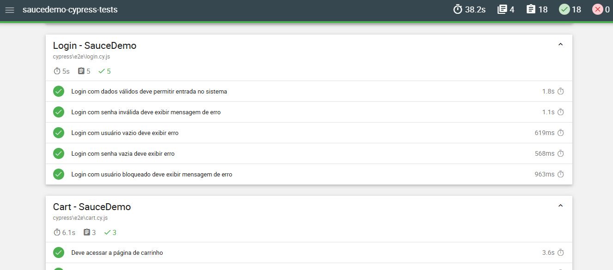

# SauceDemo - Automação Web E2E com Cypress


Projeto de automação de testes **End-to-End (E2E)** desenvolvido com **Cypress e JavaScript**, utilizando a aplicação **SauceDemo** como sistema sob teste.

O projeto cobre fluxos importantes da aplicação, incluindo autenticação, navegação pelo inventário, gerenciamento do carrinho e checkout, aplicando boas práticas de organização, reutilização de código, utilização de fixtures, custom commands e geração de relatórios de execução.

---

## Tecnologias Utilizadas

- Cypress 15.14.1
- JavaScript (ES6+)
- Node.js 24.x
- Mochawesome
- Git
- GitHub

---

## Funcionalidades Automatizadas

### Login

#### Cenários positivos

- Login com credenciais válidas

#### Cenários negativos

- Login com senha inválida
- Login com usuário vazio
- Login com senha vazia

---

### Inventory

- Validação da listagem de produtos
- Validação de nome e preço dos produtos
- Adição de produto ao carrinho
- Remoção de produto do carrinho

---

### Cart

- Acesso à página do carrinho
- Validação de produto adicionado
- Validação de nome e preço do produto no carrinho

---

### Checkout

#### Cenários positivos

- Início do checkout
- Preenchimento dos dados
- Finalização da compra
- Validação da mensagem de sucesso

#### Cenários negativos

- Checkout sem nome
- Checkout sem sobrenome
- Checkout sem CEP

---

## Estrutura do Projeto

```text
saucedemo-cypress-tests/
│
├── .github/
│   └── workflows/
│       └── cypress.yml
│
├── assets/
│   └── report-html.png
│
├── cypress/
│   ├── e2e/
│   │   ├── cart.cy.js
│   │   ├── checkout.cy.js
│   │   ├── inventory.cy.js
│   │   └── login.cy.js
│   │
│   ├── fixtures/
│   │   ├── checkout.json
│   │   ├── example.json
│   │   └── login.json
│   │
│   └── support/
│       ├── commands/
│       │   ├── cart.js
│       │   ├── checkout.js
│       │   ├── common.js
│       │   ├── inventory.js
│       │   └── login.js
│       ├── commands.js
│       └── e2e.js
│
├── .gitignore
├── README.md
├── cypress.config.js
├── package-lock.json
└── package.json
```

---

## Instalação do Projeto

### Clonar o repositório

```bash
git clone https://github.com/AndyTex2003/saucedemo-cypress-tests.git
```

### Acessar a pasta do projeto

```bash
cd saucedemo-cypress-tests
```

### Instalar as dependências

```bash
npm install
```

---

## Como Executar os Testes

### Abrir o Cypress

Abre a interface gráfica do Cypress para seleção e execução interativa dos testes.

```bash
npm run cy:open
```

### Executar os testes em modo headed

Executa os testes exibindo o navegador durante a execução.

```bash
npm run cy:headed
```

---

## Relatórios HTML

O projeto utiliza **cypress-mochawesome-reporter** para geração de relatórios HTML das execuções automatizadas.

### Gerar o relatório

Execute a suíte de testes em modo headless:

```bash
npm test
```

Os arquivos do relatório são gerados na pasta:

```text
cypress/reports/
```

A pasta de relatórios é gerada durante a execução dos testes e, por isso, não aparece na estrutura versionada do projeto.

### Preview do relatório



---

## Boas Práticas Aplicadas

- Organização dos testes por feature
- Uso de custom commands
- Modularização dos commands
- Reutilização de código
- Uso de fixtures para massa de teste
- Uso de seletores estáveis (`data-test`)
- Separação entre cenários positivos e negativos
- Estrutura escalável para evolução da automação
- Geração de relatórios automatizados

---

## Evoluções Futuras

- Disponibilizar os relatórios de execução como artifacts do GitHub Actions.
- Executar a suíte automatizada em múltiplos navegadores.
- Avaliar a adoção de Page Objects para cenários que demandem maior abstração da interface.
- Integrar a execução dos testes a um ambiente Docker.
- Expandir a cobertura automatizada com novos cenários e comportamentos da aplicação.

---

## Autor

**Anderson Batista dos Santos**

QA | Testes de Software | Qualidade de Software

- LinkedIn: [linkedin.com/in/anderson-santos-qa](https://www.linkedin.com/in/anderson-santos-qa/)
- GitHub: [github.com/AndyTex2003](https://github.com/AndyTex2003)


